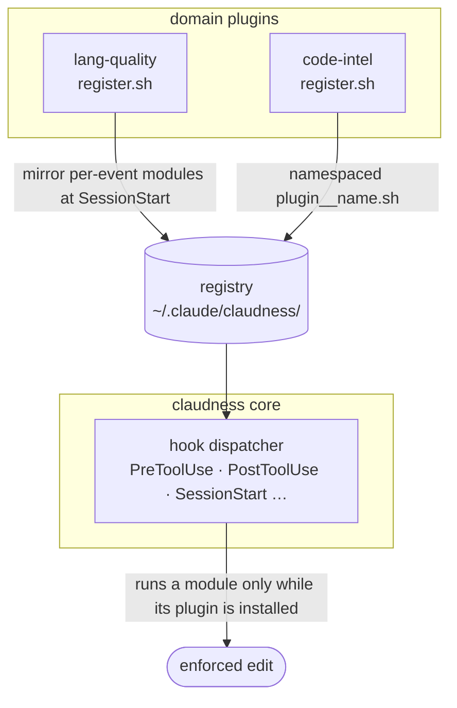

<div align="center">

# claudness

### Engineering discipline, wired into Claude Code.

AI writes code fast — then skips the parts that keep a codebase alive: oversized files, swallowed errors, mock-only tests, undocumented exports, unreviewed pushes. **claudness** bakes that discipline back in — as hooks that gate every edit, skills that enforce a design → review → build → review → test cadence, and a plugin registry so language-specific rules ride along automatically.

[](https://github.com/Falconiere/claudness/releases)
[](./LICENSE)
[](#testing)
[](https://claude.com/claude-code)
[](#contributing)

[Install](#install) · [What's inside](#whats-inside) · [The quality gate](#the-quality-gate) · [Workflow skills](#workflow-skills) · [Configuration](#configuration)

</div>

---

## Why

Claude Code is a superb pair-programmer, but left alone it optimizes for *getting the change in*, not for the conventions that make a change safe to keep. You end up re-typing the same review feedback every session: *split that file, don't swallow that error, that test is all mocks, document the export, don't push that unreviewed.*

claudness moves those rules out of your head and into the tool:

- **Hooks enforce on every edit** — a `PostToolUse` quality gate checks each file Claude touches and **blocks the session from moving on while any error, warning, or test failure exists** — even in unrelated files.
- **Skills enforce a process** — an opinionated 8-phase workflow with a write/review checkpoint at every step, so design happens before code and review happens before "done."
- **A registry keeps it modular** — drop in a domain plugin (Rust rules, TypeScript rules, structural search) and its hook modules register themselves into the core engine, fail-closed, with zero wiring.

It's a personal bundle, built in the open, MIT-licensed. Take the whole thing or lift the pieces you like.

## Install

Install from the public marketplace in any Claude Code session:

```text
# 1. Add the upstream marketplaces the plugins depend on
/plugin marketplace add anthropics/claude-plugins-official
/plugin marketplace add JuliusBrussee/caveman

# 2. Add this marketplace and install the core bundle
/plugin marketplace add Falconiere/claudness
/plugin install claudness@falconiere
```

Add the language gates and structural-search tooling too:

```text
/plugin install lang-quality@falconiere   # Rust + TypeScript quality gates
/plugin install code-intel@falconiere     # ast-grep + persistent memory
```

> **Note** — `code-intel` and `lang-quality` depend on `claudness`; `claudness` depends on `code-simplifier` (official) and `caveman`. Adding the marketplaces in step 1 lets Claude Code resolve those automatically. The `push-review` gate is **reviewer-agnostic** — it does not force you to use caveman: `caveman:cavecrew-reviewer` is preferred when present, otherwise the built-in `/code-review` skill satisfies the gate.

## What's inside

Three plugins, one marketplace. Install the core alone, or add the domain plugins.

| Plugin | Version | What it does |
|--------|:-------:|--------------|
| **`claudness`** | `1.5.0` | The core: a registry-driven hook engine, the workflow skill chain, slash commands, the `deep-explore` agent, and a gate-aware statusline. |
| **`lang-quality`** | `0.1.0` | `PostToolUse` quality gates for **Rust** and **TypeScript** — size limits, error-handling rules, test placement, and more, registered into the core engine. |
| **`code-intel`** | `0.2.0` | Structural code search (**ast-grep**) and persistent cross-session **memory** (**comemory ≥ 0.8.0**), with `PreToolUse` enforcement modules. |

## The quality gate

The headline feature. When `lang-quality` is installed, every Rust/TypeScript file Claude edits is checked on the spot. Limits are **config-driven** (project/user override → the active native linter's `max-lines` → built-in default), and the gate is **multi-slot**: a failing test command and a failing file check are tracked independently, so fixing one never silently masks the other.

<table>
<tr><th align="left">TypeScript</th><th align="left">Rust</th></tr>
<tr valign="top"><td>

- File / function line limits
- No `../` relative imports — use the `@/` alias
- No `as` type assertions — use a type guard
- No hand-rolled type guards — use a Zod schema
- Tests colocated in a flat `__tests__/`
- Duplicate-type detection across the tree
- "Does too much" / too-many-factories heuristics

</td><td>

- File / function / `impl` line limits
- No `.unwrap()` / `.expect()` — use `?` or `match`
- No `unsafe` blocks
- No `#[allow]` / `#[expect]` lint suppression
- Tests in `tests/`, never inline `#[cfg(test)]`
- Flat `tests/` layout enforced

</td></tr>
</table>

The rule isn't "warn and move on" — it's a hard gate: **no new task while the gate is red.** Found a real problem? Fix it in code. (There's no "disable this check" escape hatch by design.)

## Workflow skills

A native, opinionated process chain. Each phase has a **write step and a review step**, so a design exists before planning and an audit happens before code is called done:


- **`brainstorm`** surfaces intent, constraints, and prior art before any code.
- **`spec`** writes a design contract to `docs/claudness/specs/`; **`spec-review`** audits it.
- **`plan`** turns the spec into concrete steps; **`plan-review`** checks it's executable.
- **`execution`** drives the plan with verification checkpoints; **`execution-review`** is hard-focused on error handling.
- **`test`** enforces real-data tests (no mocks), colocated by language.

Mechanical work (renames, dep bumps, one-liners) skips the ceremony — each skill declares when *not* to fire.

Plus utility skills: **`context7`** (live library docs) and **`exa-search`** (web / code search / crawl), and from `code-intel`: **`ast-grep`**, **`agent-memory`**, **`code-intel`**.

## More that comes with it

- **Gate-aware statusline** — one `jq` pass per render shows the live quality-gate status, resolved at the git root so subdir-launched sessions still see it.
- **`push-review` gate** — blocks `git push` on a feature branch until the diff has been run through `caveman:cavecrew-reviewer`, with a round cap that escalates instead of looping forever.
- **Slash commands** — `/commit`, `/review-and-commit`, `/address-pr-comments`.
- **`deep-explore` agent** — structural codebase exploration via ast-grep.
- **Caveman mode** — ultra-compressed, token-frugal output (via the `caveman` dependency).

## Architecture

Everything a plugin ships lives under its own `plugins/<name>/` directory — no symlinks, no content outside the plugin root — so a marketplace install gets the whole working tree. Domain plugins contribute hook modules to the core dispatcher through a **runtime registry**:



At `SessionStart`, each domain plugin's `register.sh` mirrors its `hooks/<event>.d/*.sh` into the registry as `<plugin-spec>__<name>.sh`. The core executes those copies **only while the owning plugin is installed** — uninstall the plugin and its rules vanish, fail-closed.

<details>
<summary><b>Full repository layout</b></summary>

```text
.
├── docs/                       # Runtime config schema, design notes
└── plugins/
    ├── claudness/              # Core plugin: hook engine + process gates
    │   ├── .claude-plugin/     # plugin.json manifest
    │   ├── skills/             # brainstorm, spec(+review), plan(+review),
    │   │                       #   execution(+review), test, context7, exa-search
    │   ├── agents/             # deep-explore
    │   ├── commands/           # commit, review-and-commit, address-pr-comments
    │   ├── hooks/              # PreToolUse / PostToolUse / SessionStart … + lib/
    │   ├── statusline.sh       # gate-aware statusline
    │   ├── tooling/            # helper CLIs (context7, exa-search) + bats tests
    │   └── settings/           # reusable settings fragments
    ├── code-intel/             # ast-grep + comemory skills, registry PreToolUse modules
    └── lang-quality/           # Rust + TypeScript PostToolUse quality modules
```

</details>

## Configuration

Toggle individual skills, hooks, or MCP servers without uninstalling anything. Drop a `~/.claude/claudness.config.json` (or per-project `$CLAUDE_PROJECT_DIR/.claude/claudness.config.json`). Defaults are opt-out — no file required.

```json
{
  "version": 1,
  "skills": { "comemory": false }
}
```

Quality-gate thresholds (file/function/impl line limits) are configurable per project and per language. Full schema and examples: [`docs/config.md`](./docs/config.md).

## Testing

The hook engine and language gates are covered by **433 [bats](https://github.com/bats-core/bats-core) tests** across 30 suites, run in CI on every push:

```sh
bats -r plugins
```

## Contributing

PRs and issues welcome.

1. Pick the right home — skill vs. agent vs. command vs. hook — and use the existing siblings as templates.
2. Add tests (`*.bats`, colocated in a `__tests__/`) for any hook logic.
3. Verify in a real Claude Code session before committing.
4. Use a [Conventional Commits](https://www.conventionalcommits.org/) subject (`feat(skills): add foo`).

## References

- [Claude Code docs](https://docs.claude.com/en/docs/claude-code) ·
  [Skills](https://docs.claude.com/en/docs/claude-code/skills) ·
  [Subagents](https://docs.claude.com/en/docs/claude-code/sub-agents) ·
  [Slash commands](https://docs.claude.com/en/docs/claude-code/slash-commands) ·
  [Hooks](https://docs.claude.com/en/docs/claude-code/hooks) ·
  [Plugins](https://docs.claude.com/en/docs/claude-code/plugins)

## License

[MIT](./LICENSE) © [Falconiere Barbosa](https://github.com/falconiere)
