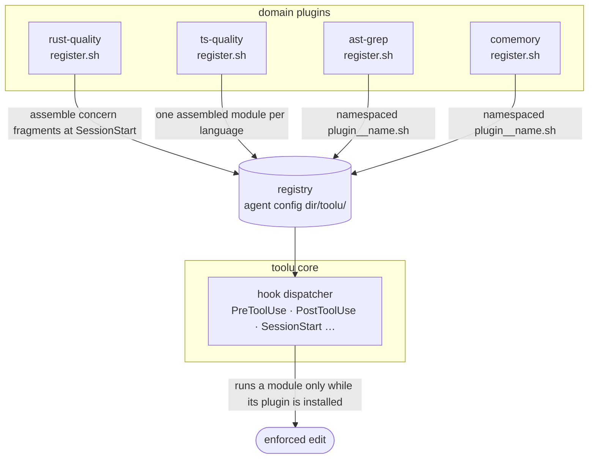

<div align="center">

# toolu

### Engineering discipline, wired into your AI coding agent.

AI writes code fast — then skips the parts that keep a codebase alive: oversized files, swallowed errors, mock-only tests, undocumented exports, unreviewed pushes. **toolu** bakes that discipline back in — as hooks that gate every edit, skills that enforce a design → review → build → review → test cadence, and a plugin registry so language-specific rules ride along automatically. Runs on **Claude Code** and **pi**.

[](https://github.com/Falconiere/toolu/releases)
[](./LICENSE)
[](#testing)
[](#install)
[](#contributing)

[Why](#why) · [The quality gate](#the-quality-gate) · [Install](#install) · [What's inside](#whats-inside) · [Workflow skills](#workflow-skills) · [Architecture](#architecture) · [Configuration](#configuration)

</div>

---

## Why

Your AI coding agent is a superb pair-programmer, but left alone it optimizes for *getting the change in*, not for the conventions that make a change safe to keep. You end up re-typing the same review feedback every session: *split that file, don't swallow that error, that test is all mocks, document the export, don't push that unreviewed.*

toolu moves those rules out of your head and into the tool:

- **Hooks enforce on every edit** — a post-edit quality gate checks each file the agent touches and **blocks the session from moving on while any error, warning, or test failure exists** — even in unrelated files.
- **Skills enforce a process** — an opinionated 8-phase workflow with a write/review checkpoint at every step, so design happens before code and review happens before "done."
- **A registry keeps it modular** — drop in a domain plugin (Rust rules, TypeScript rules, structural search) and its hook modules register themselves into the core engine, fail-closed, with zero wiring.

It's a personal bundle, built in the open, MIT-licensed. Take the whole thing or lift the pieces you like — on Claude Code or pi.

## The quality gate

The headline feature. When `rust-quality` and/or `ts-quality` is installed, every Rust/TypeScript file the agent edits is checked on the spot. Limits are **config-driven** (project/user override → the active native linter's `max-lines` → built-in default), and the gate is **multi-slot**: a failing test command and a failing file check are tracked independently, so fixing one never silently masks the other.

<table>
<tr><th align="left">TypeScript</th><th align="left">Rust</th></tr>
<tr valign="top"><td>

- File / function line limits
- No `../` relative imports — use the `@/` alias
- No `as` type assertions — use a type guard
- No hand-rolled type guards — use a Zod schema
- Tests colocated in a flat `__tests__/`
- Duplicate-type detection across the tree
- "Does too much" / too-many-factories heuristics

</td><td>

- File / function / `impl` line limits
- No `.unwrap()` / `.expect()` — use `?` or `match`
- No `unsafe` blocks
- No `#[allow]` / `#[expect]` lint suppression
- Tests in `tests/`, never inline `#[cfg(test)]`
- Flat `tests/` layout enforced

</td></tr>
</table>

The rule isn't "warn and move on" — it's a hard gate: **no new task while the gate is red.** Found a real problem? Fix it in code. (There's no "disable this check" escape hatch by design.)

## Install

toolu runs on two hosts — install it the way that matches yours.

### Claude Code

Install from the public marketplace in any Claude Code session:

```text
# 1. Add the upstream marketplaces the plugins depend on
/plugin marketplace add anthropics/claude-plugins-official
/plugin marketplace add JuliusBrussee/caveman

# 2. Add this marketplace and install the core bundle
/plugin marketplace add Falconiere/toolu
/plugin install toolu@toolu
```

Add the language gates, search, and docs tooling too:

```text
/plugin install rust-quality@toolu   # Rust quality gates
/plugin install ts-quality@toolu     # TypeScript quality gates
/plugin install ast-grep@toolu       # structural code search & rewrite
/plugin install comemory@toolu       # persistent cross-session memory
/plugin install context7@toolu       # live library documentation lookup
/plugin install exa-search@toolu     # web / code / URL search + research
```

> **Note** — `comemory`, `rust-quality`, and `ts-quality` depend on `toolu`; `ast-grep`, `context7`, and `exa-search` are standalone (zero deps); `toolu` depends on `code-simplifier` (official) and `caveman`. Adding the marketplaces in step 1 lets Claude Code resolve those automatically. The `push-review` gate is **reviewer-agnostic** — it does not force you to use caveman: `caveman:cavecrew-reviewer` is preferred when present, otherwise the built-in `/code-review` skill satisfies the gate.

### pi

toolu is also installable as a **pi package**:

```bash
pi install https://github.com/Falconiere/toolu
```

The package exposes the same discipline through pi's extension API:

- the toolu workflow skills (`brainstorm`, `spec`, `plan`, `execution`, `test`, …)
- the `ast-grep`, `agent-memory`, `code-review`, `context7`, and `exa-search` skills
- a pi extension that reuses toolu's pre/post-tool shell hooks for:
  - protected-file and bash-command blocking
  - quality-gate enforcement between steps
  - TS/Rust post-edit checks
  - live gate status in pi's footer

Config lives at `~/.pi/agent/toolu.config.json` (user) or `.pi/toolu.config.json` (project) — see [`docs/config.md`](./docs/config.md).

## What's inside

Ten plugins, one marketplace. Install the core alone, or add the domain plugins. The same skills and gate run on Claude Code and pi; the statusline is Claude Code only (pi surfaces gate status in its own footer).

| Group | Plugin | Version | What it does |
|--------|--------|:-------:|--------------|
| Core | **`toolu`** | `1.14.0` | The registry-driven hook engine plus the 8-phase workflow skills, slash commands, the `push-review` gate, and the `deep-explore` agent. The one required plugin. |
| Quality gate | **`rust-quality`** | `0.1.0` | Rust `PostToolUse` checks — file / function / `impl` size limits, `.unwrap()`/`.expect()` bans, no `unsafe`, no lint suppression, tests in a flat `tests/`. Registers into the core engine. |
| Quality gate | **`ts-quality`** | `0.1.0` | TypeScript `PostToolUse` checks — size limits, no `../` imports, no `as` / hand-rolled guards, colocated `__tests__/`, duplicate-type detection. Registers into the core engine. |
| Code intel | **`ast-grep`** | `0.1.0` | Structural code search & rewrite (**ast-grep**) — adds the `ast-grep` skill and a `Grep → ast-grep` nudge mirrored into the registry. Standalone. |
| Code intel | **`comemory`** | `0.1.0` | Persistent cross-session **memory** + code-index search (**comemory ≥ 0.8.0**), with `PreToolUse` scope enforcement and a `SessionStart` memory-count publisher for the statusline. |
| Knowledge | **`context7`** | `1.14.0` | Live **library documentation** & code-example lookup via the Context7 REST API. Standalone, no dependencies. |
| Knowledge | **`exa-search`** | `1.14.0` | **Web / code / URL search** plus deep research via the Exa REST API. Standalone, no dependencies. |
| Workflow | **`code-review`** | `0.1.0` | `code-review:review` — pre-push review mirroring the CI bot's checklist (correctness, security, perf, coverage, doc accuracy); writes the `push-review` state so the gate passes. Standalone. |
| Workflow | **`pr-babysit`** | `0.1.0` | `/pr-babysit:babysit` — cron-driven PR babysitter that fetches review comments + the CI review-bot verdict, triages, fixes, and chases findings to zero until CI is green. |
| UI | **`statusline`** | `0.3.0` | Optional gate-aware statusline — `model \| effort \| ctx \| wk \| gate \| folder \| branch \| mem \| caveman`, wired via a stable symlink (`/statusline:setup` to enable). Claude Code only. Standalone. |

Beyond the plugins, the core (`toolu`) also ships:

- **`push-review` gate** — blocks `git push` on a feature branch until the diff has been run through an accepted reviewer (`caveman:cavecrew-reviewer` when installed, the built-in `/code-review xhigh --fix` skill, or the `code-review:review` skill), with a round cap (5) that escalates instead of looping forever.
- **Slash commands** — `/commit` and `/review-and-commit`.
- **`deep-explore` agent** — structural codebase exploration via ast-grep.
- **Caveman mode** — ultra-compressed, token-frugal output (via the `caveman` dependency).

## Workflow skills

A native, opinionated process chain. Each phase has a **write step and a review step**, so a design exists before planning and an audit happens before code is called done:


- **`brainstorm`** surfaces intent, constraints, and prior art before any code.
- **`spec`** writes a design contract to `docs/toolu/specs/`; **`spec-review`** audits it.
- **`plan`** turns the spec into concrete steps; **`plan-review`** checks it's executable.
- **`execution`** drives the plan with verification checkpoints; **`execution-review`** is hard-focused on error handling.
- **`test`** enforces real-data tests (no mocks), colocated by language.

Mechanical work (renames, dep bumps, one-liners) skips the ceremony — each skill declares when *not* to fire.

The workflow skills, plus `ast-grep`, `agent-memory` (from `comemory`), `context7`, and `exa-search`, all run identically on Claude Code and pi.

## Architecture

Everything a plugin ships lives under its own `plugins/<name>/` directory — no symlinks, no content outside the plugin root — so a marketplace install gets the whole working tree. Domain plugins contribute hook modules to the core dispatcher through a **runtime registry**:



At `SessionStart`, each domain plugin's `register.sh` contributes to the registry as `<plugin-spec>__<name>.sh` — `ast-grep` and `comemory` mirror their `hooks/<event>.d/*.sh` one-to-one, while `rust-quality`/`ts-quality` assemble their ordered `hooks/concerns/` fragments into a single module per language. The core executes those copies **only while the owning plugin is installed** — uninstall the plugin and its rules vanish, fail-closed.

<details>
<summary><b>Full repository layout</b></summary>

```text
.
├── docs/                       # Runtime config schema, design notes
├── pi/                         # pi extension (reuses the shell hooks) + tests
└── plugins/
    ├── toolu/                  # Core plugin: hook engine + process gates
    │   ├── .claude-plugin/     # plugin.json manifest
    │   ├── skills/             # brainstorm, spec(+review), plan(+review),
    │   │                       #   execution(+review), test
    │   ├── agents/             # deep-explore
    │   ├── commands/           # commit, review-and-commit
    │   ├── hooks/              # PreToolUse / PostToolUse / SessionStart … + lib/
    │   └── settings/           # reusable settings fragments
    ├── ast-grep/               # ast-grep skill + Grep→ast-grep nudge registry module
    ├── comemory/               # agent-memory skill + scope-enforcement & memory-count registry modules
    ├── context7/               # context7 skill + Context7 REST wrapper
    ├── exa-search/             # exa-search skill + Exa REST wrapper
    ├── rust-quality/           # Rust PostToolUse quality fragments, assembled at SessionStart
    ├── ts-quality/             # TypeScript PostToolUse quality fragments, assembled at SessionStart
    ├── statusline/             # optional gate-aware statusline + SessionStart symlink hook
    ├── pr-babysit/             # /pr-babysit:babysit command + parse-verdict.sh
    └── code-review/            # code-review:review skill + push-review state writer
```

</details>

## Configuration

Toggle individual skills, hooks, or MCP servers without uninstalling anything. On Claude Code, use `~/.claude/toolu.config.json` (or `$CLAUDE_PROJECT_DIR/.claude/toolu.config.json`). On pi, use `~/.pi/agent/toolu.config.json` (or `.pi/toolu.config.json`). Defaults are opt-out — no file required.

```json
{
  "version": 1,
  "skills": { "comemory": false }
}
```

Quality-gate thresholds (file/function/impl line limits) are configurable per project and per language. Full schema and examples: [`docs/config.md`](./docs/config.md).

## Testing

The hook engine and language gates are covered by **618 [bats](https://github.com/bats-core/bats-core) tests** across 60 suites, run in CI on every push:

```sh
bats -r plugins
```

## Contributing

PRs and issues welcome.

1. Pick the right home — skill vs. agent vs. command vs. hook — and use the existing siblings as templates.
2. Add tests (`*.bats`, colocated in a `__tests__/`) for any hook logic.
3. Verify in a real session before committing.
4. Use a [Conventional Commits](https://www.conventionalcommits.org/) subject (`feat(skills): add foo`).

## References

- [Claude Code docs](https://docs.claude.com/en/docs/claude-code) ·
  [Skills](https://docs.claude.com/en/docs/claude-code/skills) ·
  [Subagents](https://docs.claude.com/en/docs/claude-code/sub-agents) ·
  [Slash commands](https://docs.claude.com/en/docs/claude-code/slash-commands) ·
  [Hooks](https://docs.claude.com/en/docs/claude-code/hooks) ·
  [Plugins](https://docs.claude.com/en/docs/claude-code/plugins)

## License

[MIT](./LICENSE) © [Falconiere Barbosa](https://github.com/falconiere)
